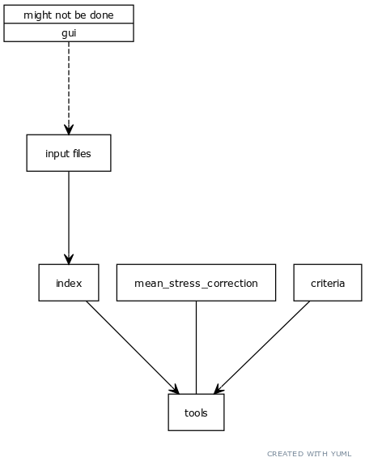
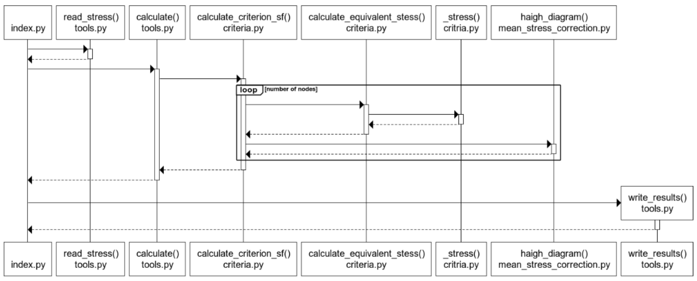

# Arkkitehtuurikuvaus

Ohjelman tarkoitus on laskea varmuuskertoimia jännityshistoria perusteella.

Ohjelman syötteitä ovat:

- Määrittelyparametrit eli mitä ohjelman halutaan laskevan (luetaan tiedostosta (json))

- Jännityshistoria (Luetaan tiedostosta (ascii))

- Materiaalitiedot (Luetaan tiedostosta (json))

(Nämä kaikki voisi generoida graafisen käyttöliittymän kautta halutessa, mutta yleensä tälläistä ohjelmaa käytetään komentoriviltä osana isompaa prosessia scriptien avulla joten json syötteet ovat luultavasti ihan kätevä valinta)

Varsinaisessa laskennassa valitaan:

- Keskijännityskorjaus (esimerkiksi Goodman tai vastaava)
- Vauriokriteeri (Esimrkiksi Von Mises, MMK, Findley, Matake ja niin edelleen)

Tulos kirjoitetaan tulostiedostoon ja sisältää tuloksen jokaiselle yksittäisen jännityshistorian yksikölle. Rajallisten resurssien takia luonnollisesti tässä harjoitustyössä ei koodata kuin yksi tai korkeintaan kaksi kriteeriä mutta loput on erittäin helppo laajentaa näin halutessaan.

### HDF5

Tietokantoja ei kannata käyttää tässä yhteydessä tiedon varastointiin vaan esimerkiksi HDF5 tai vastaavaa ratkaisua.

[Improving the scalability of Elmer finite element software](https://prace-ri.eu/wp-content/uploads/Improving_the_scalability_of_Elmer_finite_element_software.pdf)
[HDF5: A Useful Enhancement for MSC Nastran and Patran](https://simulatemore.mscsoftware.com/hdf5-a-useful-enhancement-for-msc-nastran-and-patran/)
[A new approach to interoperability using HDF5](http://congress.cimne.com/icme2016/admin/files/filepaper/p17.pdf)

Yleisesti FEM analyysissä on seuraavanlainen ongelma. Haluttuja suureita voi olla kymmeniä jos ei satoja, kuten jännitys, siirtymä, lämpötila ja muut erilaiset suureet. Jokaisella solmulla, integrointipisteellä tai elementillä halutaan tallentaa näitä tietoja. Laskenta etenee aika askeleittain ja tiedot tallennetaan yleensä aika askel 1 2 3 alle niin että joka askeleelle tallennetaan tieto aina jokaiselle yksikölle (solmu, integrointipiste, elementti) ja jokaiselle suureelle erikseen.

Kun tietoa kuitenkin luetaan niin haluttaisiin usein yhden solmun tietyn suureen koko aikahistoria. Nyt täytyy siis ottaa tieto matriisista jonka koko on kymmeniä tai satoja miljoonia solmuja (integrointipisteitä ja elementtejä), tuhansia aika-askeleita ja satoja suureita.

## Rakenne

Tarkoitus on erottaa ohjelmistologiikka, käyttöliittymä ja varsinaisen laskennan suorittavat modulit täysin toisistaan.

Käyttöliittymä ja ohjelmansuoritus ovat yhteydessä json tiedostoilla jossa on käyttöliittymän kautta syötetyt tiedot joilla ohjelma voidaan suorittaa.

## Käyttöliittymä

Ohjelmaa käytettäisiin tosielämässä osana automatisoitua prosessia eikä graafista käyttöliittymää tarvita mihinkään. Tosielämässä laskenta olisi myös erittäin raskasta ja se suoritettaisiin laskenta clusterilla.

Ohjelman syötteen voi kuitenkin helposti paitsi kirjoittaa käsin tiedostoon muodostaa myös myöhemmin kehitettävän käyttöliittymän kautta.

## Sovelluslogiikka

* 1. Lähtötiedot luodaan joko kästin tai mahdollisen GUI kautta

* 2. Ohjelma ajetaan lähtötietojen perusteella
	* 2.1 Luetaan jännityshistoria
	* 2.2 Lasketaan ekvivalentti jännitys
	* 2.3 lasketaan varmuuskerroin ja muut tulokset

* 3. Kirjoitetaan tulokset

Sovellukset suoritus on varsin suoraviivaista.
* 1. päämodulia index aletaan suorittaa jolloin luetaan lähtötiedot
	* 1.1 materials.json
	* 1.2 inputs.json
	* 1.3 lähtötiedoissa määritellyt jännityshistoria tiedostot käyttämällä tools modulin read_stress funktiota
* 2. suoritetaan modulin tools calculate funktio hakee moduleista criteria ja mean_stress_correction lähtötietoja vastaavat funktiot ja suoritus alkaa
	* 2.1 aloitetaan criteria modulin mukainen varmuuskertoimen laskenta jossa jokaiselle solmulle
		* 2.1.1 lasketaan equivalentti jännitys ensiksi muodostamalla yksiaksiaalinen jännitys ja sitten sen perusteella etsimällä historian yli amplitudi- ja keskijännitys
		* 2.1.2 suoritetaan keskijännityskorjaus
		* 2.1.3 lasketaan varmuuskerroin ja palautetaan varmuuskerroin ja muut tulokset
* 3. modulissa index kirjoitetaan modulin tools funktiolla write_results tulokset tiedostoon

Tämän jälkeen tuloksia voi tarkastella visuaalisesti vaikkapa paraviewillä kunhan solmuihin liittyvät koordinaatit ovat myös saatavilla

### Tiedostot

Data hakemistossa olevia tiedostoja ei tarvita sinänsä ohjelman ajamiseen mutta kuten aiemmin mainittua ohjelma tarvitsee jännityshistoria ascii tiedostot. ajokomenntit ja materiaali json tiedostot (input.json ja materials.json) toimiakseen joten esimerkkitiedostot ovat täällä data hakemistossa ja ainakin toistaiseksi testeissä tarvittavat tiedostot myös.